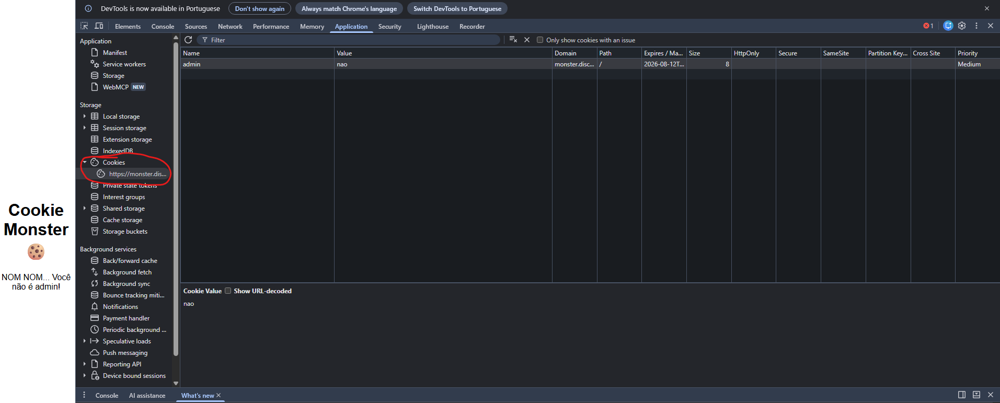

Ao analisar a aplicação, foi necessário utilizar as ferramentas de desenvolvedor do navegador para verificar as informações armazenadas pelo site.
Durante a análise dos cookies, foi identificado um cookie responsável por determinar o nível de acesso do usuário. O valor desse cookie foi alterado para conceder privilégios de administrador.
Após realizar a alteração e atualizar a página, o usuário passou a possuir privilégios de admin, permitindo acessar a área que anteriormente estava restrita e visualizar a flag.

FLAG{C00K1E_M0NST3R_MUNCH}
