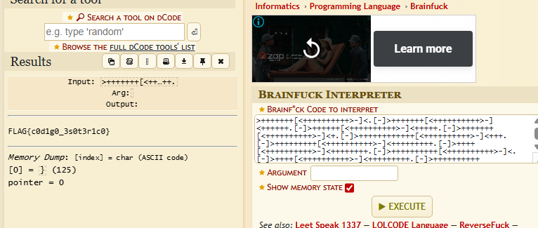

Ao analisar o desafio, foi possível identificar que a mensagem estava codificada utilizando a linguagem esotérica Brainfuck.
Esse padrão permitiu determinar rapidamente o método de decodificação a ser utilizado.

Resolução
O código Brainfuck foi copiado e inserido na ferramenta dCode Brainfuck Decoder, responsável por interpretar as instruções e executar o programa.
Após a execução, a saída gerada revelou o conteúdo oculto da mensagem. Em desafios desse tipo, é comum que o resultado já seja a flag ou uma nova camada de codificação a ser analisada.

